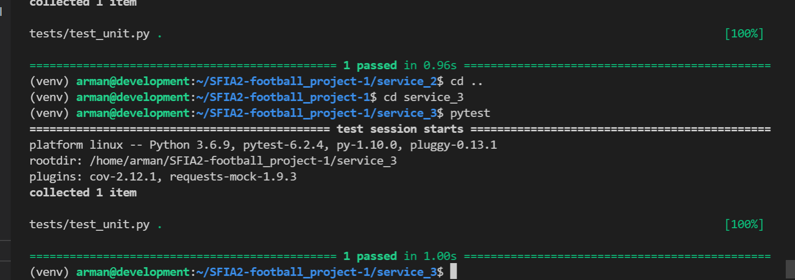

# DevOps Core Practical Project
## Football Project Generator
# 
#
* [Introduction](#Introduction) 
  * [Objetives & Project Proposal](#)
  * [Requirements](#)
* [Sofware Architecture](#architecture)
  * [Project Management](#trello)
  * [Risk Assessment](#risk)
  * [Database Structure](#entity-relationship-diagram)
  * [Continuous Integration Pipeline](#CI)
* [Software Infrastructure](#softwareinfrastructure)
  * [Jenkins](#jenkins)
  * [Services](#SERVICES)
  * [Front-End](#FrontEnd)
* [Components In Detail](#components)
  * [Docker](#docker)
  * [Docker-compose](#docker-compose)
  * [Swarm](#Swarmconfig)

* [Testing](#Testing)
  * [Unit Testing](#Unitteting)
  * [Test Coverage](#testcoverage)
* [Future Improvements & Constraints](#FutureImprovementsandproblems)
* [Author](#Author)
* [Acknowledgements](#Acknowledgements)

## Introduction 
#

### Objetives & Project Proposal

This was an indidual project which involved me creating a service-orientated architecture application which had to be made up of four services. Service one is the core service, meaning it is the front-end that the user will see which should render the Jinja2 templates that interacts with my application, as well as communicating with other services.

The idea I went with was to create a player score generator that predicts if a player would score against a given team that was defined in the 'server_2' routes file. The user will first connect server 1 which will display the webpage, however before displaying the page, a GET request is made to service 2 & 3. Service will 2 will then return a random player, and service 3 a random team. Then a POST request is made to service 4 sending the random 'player' and'team' information obtained from the previous GET requests. Service 4 consists of nested IF staements that assigns a player to a team and returns an outcome, whether the player will score or not.

### Requirements

In order to achieve the brief and achieve the SFIA requirements, the following requirements must be achieved:

* Kanban board
* Relational database 
* Clear documentation 
* An application fully integrated using the feature branch model into a Version Control System (VCS). The VCS will be built through a CI server (Jenkins) and deployed to a cloud-based virtual machine. 
* When any change is made to the code it is pushed to the VCS, webhooks must be set up for the CI server to recreate and redeploy the application
* Containerisation: Docker
* Ansible playbook must be made that will provide the environment for the application to run.
* A reverse proxy must be set up to make the applciation accessible to the user(NGINX).

## Software Architecture
#
### Project Management
For the project management I used a Kanban board on Trello. I found that Trello is very easy to use and is free.
I found it very easy to organise the tasks I need to get done. Below is an image of my Trello board aswell as a link to my Trello board as I was unable to show the whole Kanban board in one picture.

Click this link to navigate to my Trello Board
[here](https://trello.com/b/iA3JCQr0/project-2-kanban)
### Risk Assessment
A picture of a detailed risk assesment can be found below.

### Database Structure
I have included pictures of an ERD diagram showing the structure of the database aswell as the database shown in SQL.

 

### Continuous Integration Pipeline
The image below shows how the CI pipeline is used for my project. I begin with my project management using Trello board, once I have pushed up my latest code to GitHub, this will trigure a webhook which I have added. This then automatically starts the jenkins pipeline. First, the requirements are installed, then the tests are done. Then using Docker-compose, the images will be built for all servers and pushed on to Dockerhub. Jenkins will then use Ansible to configure external nodes, including installing Docker on them. Ansible also configures as a load balancer node.The user finally conects to the load balancer and recieves the web page.

## Software Infrastructure
#
### Jenkins 
Jenkins is a free and open source automation server. It helps automate the parts of software development related to building, testing, and deploying, facilitating continuous integration and deployment. 

For this project, the stages of the Jenkins pipeline is as follows: 
* Testing - Which produces coverage reports on the console
* Build and push images - Docker-compose is used to build the images and push them to Docker-Hub
* Ansible configuration - Allows us to configure several servers at once, including:
* * Installing necessary dependencies,Initializing the swarm and connecting to worker nodes and Configuring the NGINX server for load-balancing
* Deploy stack - Configures the web-applcation on the manager and worker nodes

Further details on these stages used in the Jenkins pipeline can be found in the jenkinsfile. Below, I have also included an imagine of how the build appears on jenkins.

### Services

The project must include a minimum of 4 services as part of the MVP. The picture below shows how my services interact with each other.

### Front-end

## Components in detail

### Docker
Docker is a tool designed to make it easier to create, deploy, and run applications by using containers. Containers allow a developer to package up an application with all of the parts it needs, such as libraries and other dependencies, and deploy it as one package. These are defined inside my Dockerfile(s)

### Docker-compose
Docker compose is a tool that needs to be installed alongside docker. This tool automates the docker build process. 
By running docker-compose, you don't have to install or maintain the software on your local machine. Your entire local development environment can be checked into source control, making it easier for other developers to collaborate on a project. The services that are created inside this file will be in the same network allowing for for each service to communicate with one another. Below is a picture of my images being built on Dockerhub

### Swarm
The swarm manager, both workers and NGINX all run on seperate VM's on Google Cloud Platform. The way in which the swarm works:
- It starts with the manager, it pulls down the services and runs copies of them across to the workers
- This exists so that indivudual containers arent overloaded by heavy traffic and so that if either server or any container stops working the app will continue to run.
- Nginx then acts as a reverse proxy
- It also directs which tasks will be used for each user balancing the load and making sure the containers are distributed appropriately.

The image below shows a basic set up of the swarm. Once Ansible installs docker on both swarm-manager and swarm-worker nodes. It then intialises the swarm on the manager node and joins the worker nodes.

## Testing 
#
### Unit Testing
For my project I implemented unit testing in the application. I tested all services. Unit testing allows us to test whether each function reuturns an expected response. The pictures below shows pytest running on each server.

Unit Testing on Service 1

Unit Testing on Service 2

Unit Testing on Service 3

Unit Testing on Service 4

### Testing Coverage
My testing coverage did not meet the pass requirements as i only achieved a 72%. I was pretty overwhelmed with my workload and had lots of issues with GCP, so I had to move on and priorotize my time with the automation and jenkins.

## Future Improvements & Constraints
#

Despite my test coverage I think my application was a success. In future I believe I can definietly improve on my testing and add more testing to make it even more robust.

One big problem I ran into was being limited to 4 instances in one location.This caused me major issues as I had to constantly switch between instances by stopping and starting them. This was very frustrating and held me back.
I have attatched pictures of some of errors I mentioned above.

- Unable to create a 5th instance.

- Limited to only 4 VMs in one region (europre-west2)

- Submitted a case, requesting to increase my instance limit from 4 to 5

- My request was denied, which lead to further difficulties with the deployment of the whole project. Therefore, some oppurtunity costs had to be made with the test coverage as this problem made me prirotize more importants tasks such as deployment of the application via jenkins

## Author
#
- Arman Khan
## Acknowledgements
#
- Harry Volker

- Ben Hesketh

- Raji Kolluru

